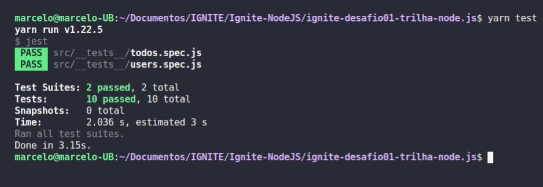

# ignite-desafio01-trilha-node.js
Desafio 01 - Conceitos do Node.js

<h1 align="center">
    
</h1>

Nesse desafio, foi criado uma aplicação para treinar o que foi aprendido até agora na trilha Node.js!

Essa e uma aplicação para gerenciar tarefas (em inglês *todos*). 
Será permitida a criação de um usuário com `name` e `username`, bem como fazer o CRUD de *todos*:

- Criar um novo *todo*;
- Listar todos os *todos*;
- Alterar o `title` e `deadline` de um *todo* existente;
- Marcar um *todo* como feito;
- Excluir um *todo*;
